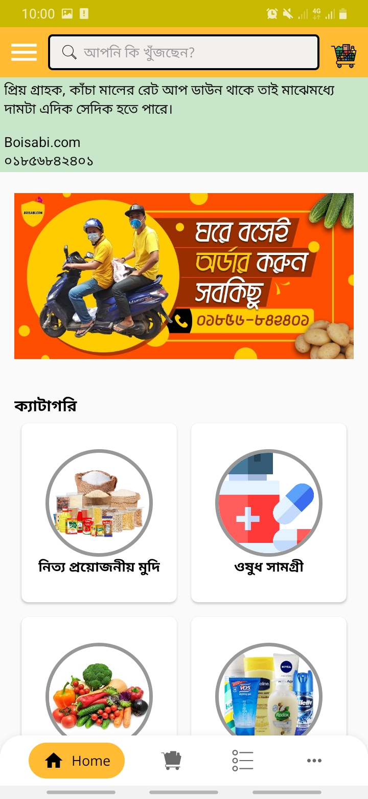
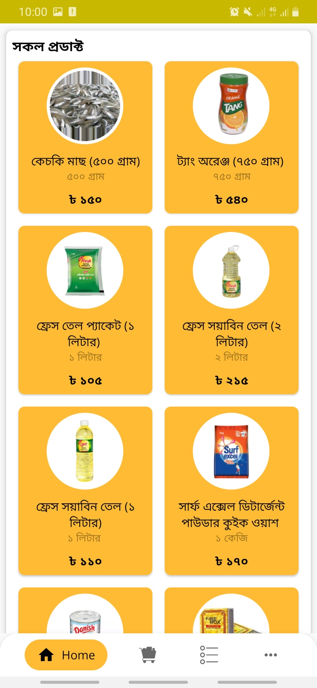
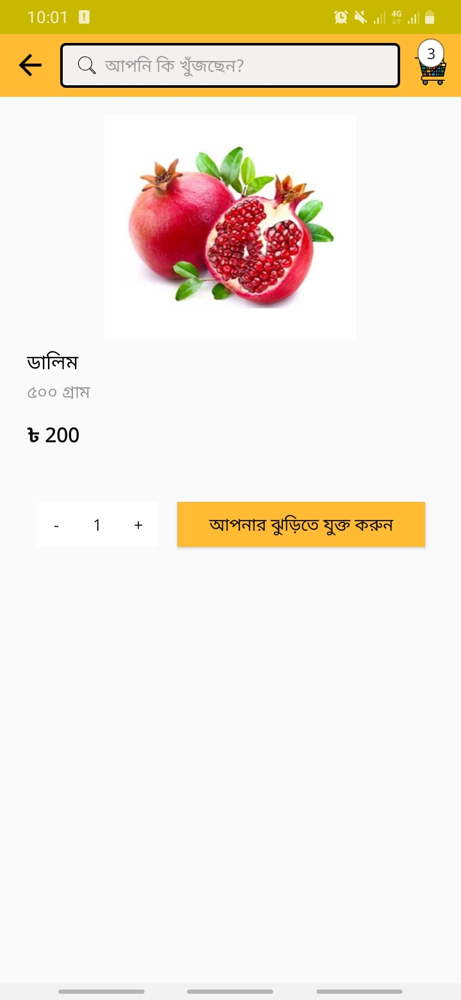
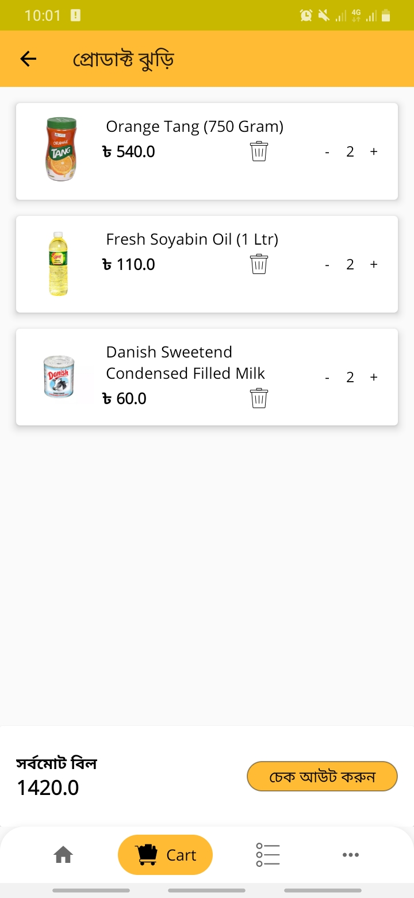
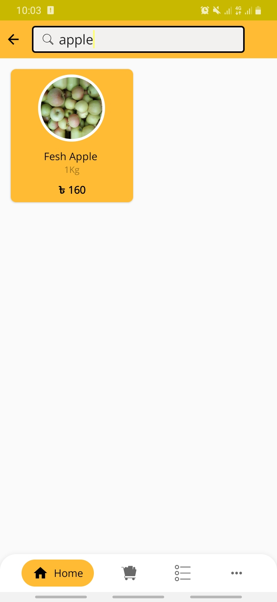
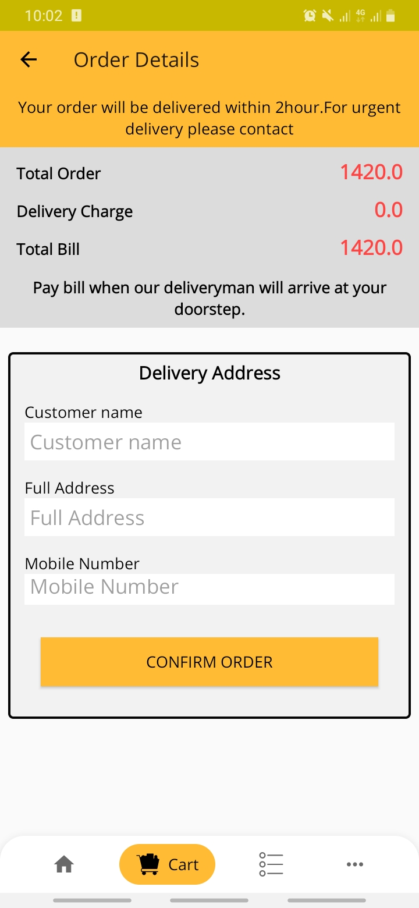

# Boisabi.com -Android Grocery App
Boisabi.com is my very first production app from **Brogrammers** sister concern of [BROTECHIT](https://brotechit.com/home "Website Link"). 

## How To Use App
For production level security I'm unable to share source code with you. That's why you may find here [Boisabi.com Google Playstore](https://play.google.com/store/apps/details?id=com.brogrammers.boisabi "Google Playstore").
Install the app and you may find everything. 

## User Stories
-A user can order from app for `Cash on Delivery`

## Project Architecture
-Android `MVVM` Architecture

-Room Database

-LiveData

-Backend: Google Firebase

## Features
-Single OTP Verification

-Random Order

-Order TrackDown

-Order completion notification

-Push Notifications

-Inapp push Messaging

-Bangla & English language

## Future Features
-Order GPS tracking

-Provide Hub for collecting orders

-Online Payment system

## How the app looks like
**1.** Home Page

**2.** All Products

**3.** Single Product Details

**4.** Product Cart

**5.** Search Product

**6.** Order Form

